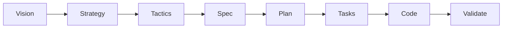

# VDD Dogfood Example — Personal Task Tracker

[](LICENSE)

> **A dogfood example for [Vision Driven Design](https://github.com/simonplmak-cloud/vision-driven-design)** — a personal task tracker built end-to-end through the VDD 8-phase chain, from vision to validation.

This is a reference for what a complete VDD run produces: the constitution, vision, strategy, tactics, spec, plan, task breakdown, implementation, and validation artifacts are all committed together.

## VDD Chain



## Artifacts

- [`constitution.md`](constitution.md) — Project constitution
- [`vdd/vision.md`](vdd/vision.md) — Impact model and success metrics
- [`vdd/strategy.md`](vdd/strategy.md) — Research synthesis and strategic pillars
- [`vdd/tactics.md`](vdd/tactics.md) — Codebase audit and action items
- [`vdd/specs/task-crud/spec.md`](vdd/specs/task-crud/spec.md) — Acceptance criteria
- [`vdd/specs/task-crud/plan.md`](vdd/specs/task-crud/plan.md) — Technical design
- [`vdd/specs/task-crud/tasks.md`](vdd/specs/task-crud/tasks.md) — Task breakdown
- `src/` — Implementation (generated by AI constrained by specs)

## Quick Start

```bash
npm install
npm run dev
```

Open http://localhost:3000

## Tech Stack

TypeScript · Next.js 15 · Tailwind CSS · SQLite · Drizzle ORM

## License

MIT — see [LICENSE](LICENSE).

---

If this saves you time, a ⭐ on GitHub helps others find it.
